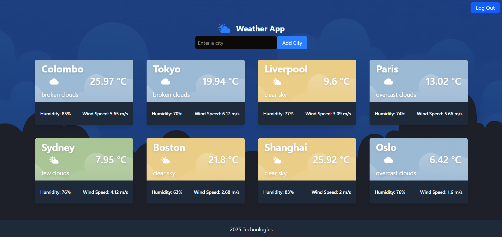
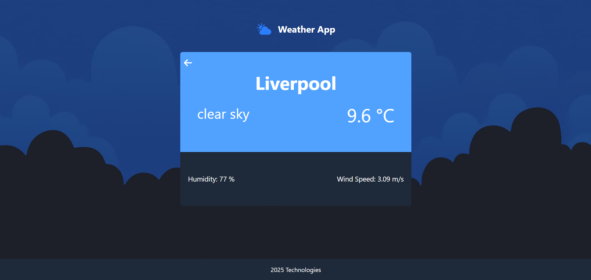
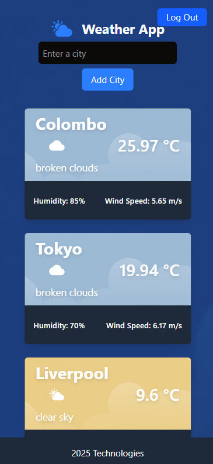

# Weather App 🌦️

A full-stack **Weather App** built using the **MERN stack** (MongoDB, Express.js, React, Node.js). This application allows users to authenticate securely, view real-time weather data for cities, and manage their personalized weather information. It integrates the **OpenWeatherMap API** for weather data and **Auth0** for secure user authentication, including multi-factor authentication (MFA).


### Weather Dashboard




### Responsive Mobile View



## ✨ Features

- **Real-time Weather Display**: Get up-to-the-minute weather updates for various cities.
- **Secure Authentication**: Log in and register securely via **Auth0**, with optional multi-factor authentication for enhanced security.
- **Efficient Caching**: Weather data is cached for 5 minutes to reduce API calls and improve performance.
- **Responsive Design**: The UI adapts seamlessly to both mobile and desktop devices, ensuring a great user experience everywhere.

## 📋 Prerequisites

Before you begin, ensure you have the following installed and set up:

- **Node.js** (version 14 or higher)
- An **Auth0** account to manage user authentication credentials

## ⚙️ Required Environment Variables

Create a `.env` file in the **backend** directory with the following variables:

```
OPENWEATHERMAP_API_KEY=your_openweathermap_api_key  
AUTH0_DOMAIN=your_auth0_domain  
AUTH0_CLIENT_ID=your_auth0_client_id
```

## 🚀 Getting Started

Follow these steps to get the app running on your local machine:

### 1. Clone the Repositories

Clone both the frontend and backend repositories from GitHub:

```
git clone https://github.com/DhanukaNaveen/weatherapp_frontend.git  
git clone https://github.com/DhanukaNaveen/weatherapp_backend.git
```

### 2. Install Dependencies

Navigate into each directory and install the required dependencies:

#### Backend:

```
cd weatherapp_backend  
npm install
```

#### Frontend:

```
cd weatherapp_frontend  
npm install
```

### 3. Start the Backend Server

Navigate to the backend directory and run the server:

```
cd weatherapp_backend  
npm start
```
The backend server will start at http://localhost:5000.

### 4. Start the Frontend Server

In a new terminal window, navigate to the frontend directory and start the development server:

```
cd weatherapp_frontend  
npm run dev
```
The frontend application will now be running at http://localhost:5173.


## 🛠️ Technologies Used

- **Frontend**: React.js, Vite, TailwindCSS
- **Backend**: Node.js, Express.js
- **Authentication**: Auth0 (with MFA)
- **Weather API**: OpenWeatherMap
- **Caching**: NodeCache


